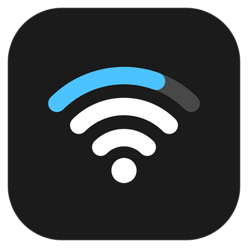
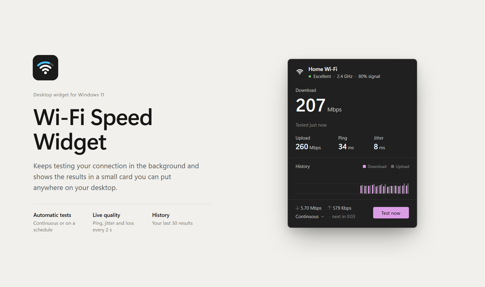
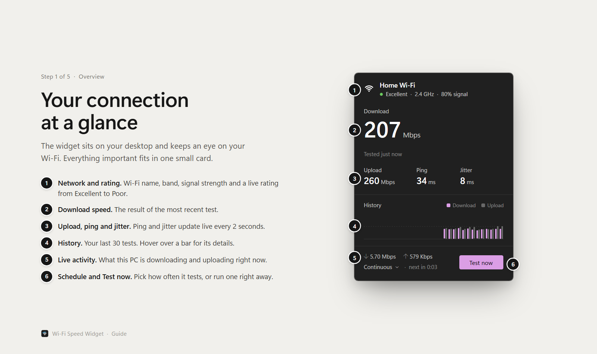
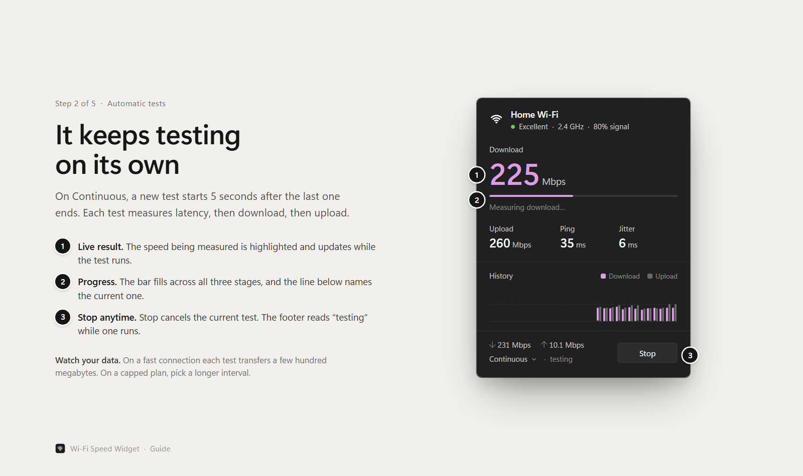
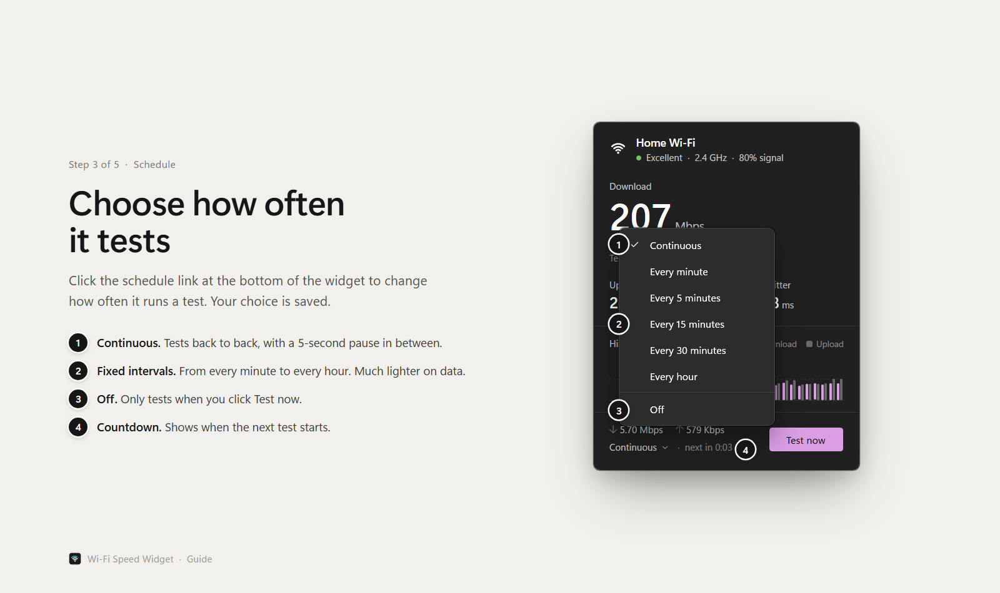
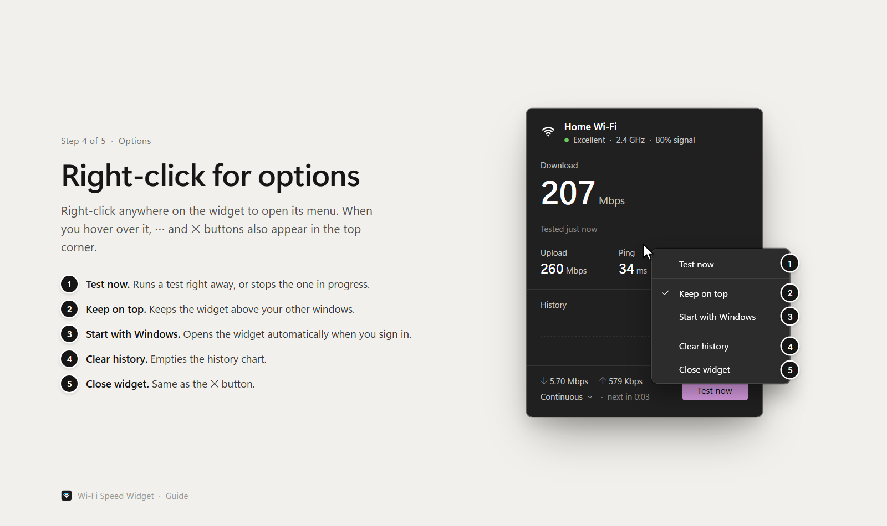
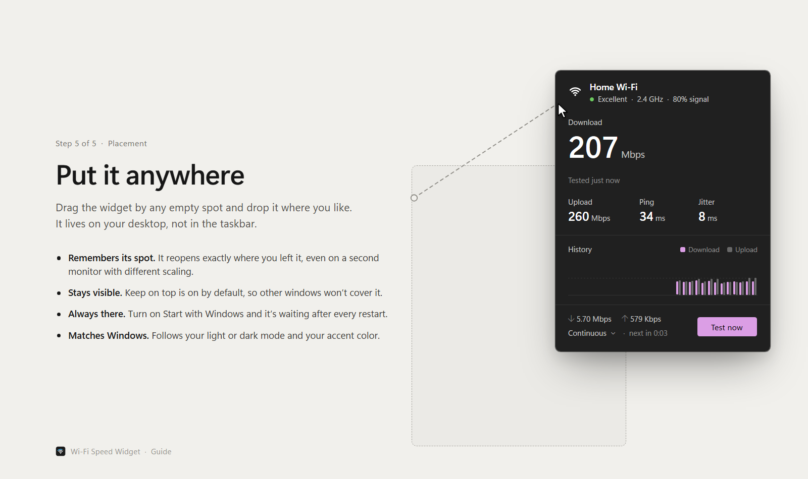

<p align="center">
  
</p>

<h1 align="center">Wi-Fi Speed Widget</h1>

<p align="center">A small, draggable Windows desktop widget that keeps testing your connection.</p>



## Guide

### 1. Your connection at a glance



### 2. It keeps testing on its own



### 3. Choose how often it tests



### 4. Right-click for options



### 5. Put it anywhere



## Features

- Automatic speed tests: continuous, or every 1, 5, 15, 30 or 60 minutes
- Live ping, jitter and packet loss with a connection rating
- Wi-Fi network name, band and signal strength
- History of recent test results
- Follows the Windows light/dark theme and accent color
- Remembers its position, even across monitors with different scaling
- Optional always-on-top and start with Windows

## Build

Requires the .NET 10 SDK. Open `WifiSpeedWidget.slnx` in Visual Studio and press F5, or run:

```
dotnet run --project WifiSpeedWidget
```

## Notes

- Speed tests use Cloudflare's speed test endpoints. If the server reports too many requests, the widget waits before testing again, starting at 2 minutes and doubling up to 30.
- On a fast connection each test transfers a few hundred megabytes. On a capped data plan, choose a longer interval.
- Settings, history and an error log are stored in `%AppData%\WifiSpeedWidget`.
