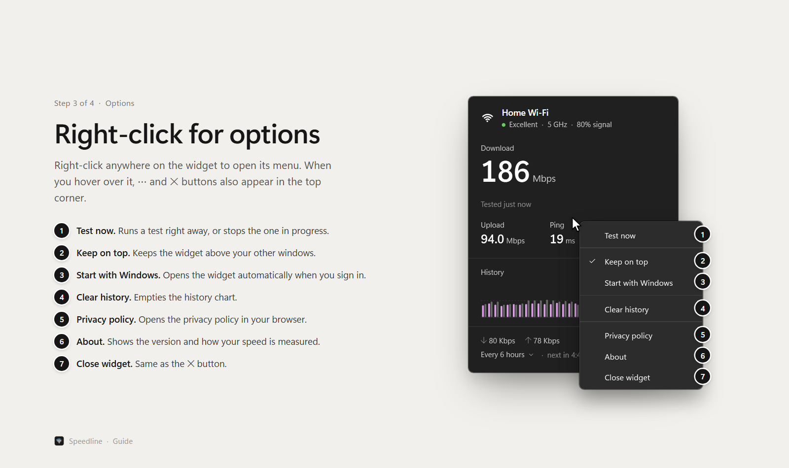
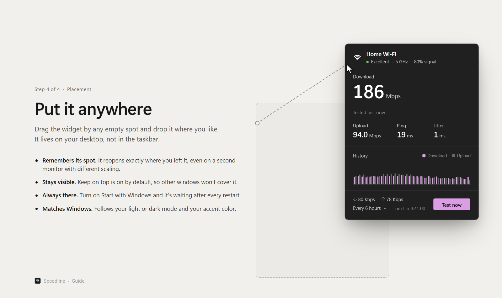

<p align="center">
  
</p>

<h1 align="center">Speedline</h1>

<p align="center">A small, draggable Windows desktop widget that tests your internet speed and watches your connection.</p>


## Guide

### 1. Your connection at a glance


### 2. It keeps testing on its own


### 3. Right-click for options



### 4. Put it anywhere



## Features

- Automatic speed tests every 3, 6 (default) or 12 hours at slightly randomized times, or only on demand
- Live ping, jitter and packet loss with a connection rating
- Wi-Fi network name, band and signal strength
- History of recent test results
- Automatic tests pause on metered connections
- Follows the Windows light/dark theme and accent color
- Remembers its position, even across monitors with different scaling
- Optional always-on-top and start with Windows
- Closing the widget hides it to a tray icon that matches your taskbar theme: hover it for your latest result, click it to bring the widget back, or right-click it to test or exit

## Install

Get Speedline from the Microsoft Store: https://apps.microsoft.com/detail/9NX12SC6603P

Windows Smart App Control blocks programs that are not digitally signed, so a build made from this source is blocked on PCs where it is on. The Store package is signed by Microsoft.

## Build

Requires the .NET 10 SDK. Open `WifiSpeedWidget.slnx` in Visual Studio and press F5, or run:

```
dotnet run --project WifiSpeedWidget
```

To build a folder you can run anywhere without installing .NET:

```
dotnet publish WifiSpeedWidget -c Release -r win-x64 --self-contained true -p:PublishSingleFile=true
```

To build the package for the Store, see [PACKAGING.md](PACKAGING.md).

## Checks

An automated kit runs the real code and drives the real widget window. It tests speed measurement against a local stand-in for the M-Lab service, so it does not use up the daily limit, and it can also run against the real service. See [tests](tests/README.md).

## How it works

- Speed tests use [Measurement Lab](https://www.measurementlab.net/) (M-Lab) and its open ndt7 protocol. M-Lab publishes the results of tests as open data, including the IP address used. See [PRIVACY.md](PRIVACY.md).
- Ping, jitter and packet loss come from small pings to 1.1.1.1 and 8.8.8.8 every couple of seconds.
- Measurement Lab is a free public service. It allows 40 tests a day from one connection and asks apps to run far fewer, so automatic tests are limited to every 3 hours at most, and the widget counts its own tests and stops at 30 automatic or 40 in total per rolling day. Live ping, jitter, packet loss and traffic keep updating all the time.
- If the test server reports too many requests, the widget waits before trying again, starting at 10 minutes and doubling up to 2 hours.
- Each test moves a few hundred megabytes on a fast connection.
- Settings, history and an error log are stored in the app's own data folder.
